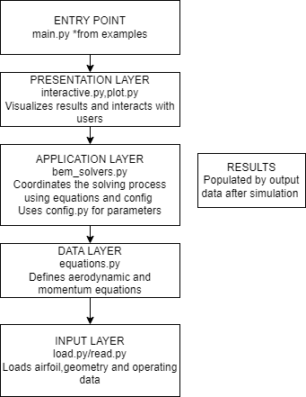

# Wind Turbine Modelling

Team: [Stop Fucking Spiders]

## Overview

**WindTurbineModeling** is a Python package for simulating the aerodynamic performance of horizontal-axis wind turbines using a steady-state Blade Element Momentum (BEM) model. The objective of this project is to compute key performance metrics—such as power output, thrust, and torque—as functions of wind speed, rotor speed, and blade pitch angle. The package includes tools for loading turbine geometry, solving BEM equations, and visualizing performance across a range of conditions.

Key features of the package include:

- A class-based structure representing wind turbines and BEM solvers.
- Functions for calculating blade element forces and solving momentum balance.
- Utilities for visualizing performance curves.
- Test coverage and documentation for maintainability and reproducibility.


## Quickstart

Follow these steps to get up and running with the project.

### 1. Clone the Repository

```bash
git clone https://github.com/DTUWindEducation/final-project-stopfuckingspiders.git
cd final-project-stopfuckingspiders
```

### 2. Pip install

```bash
 pip install -e
```

### 3. Run the Project (Example)

```bash
python examples/main.py
```

## Package Architecture

This package follows a modular design to cleanly separate data handling, computation, and visualization:

```
src/WindTurbineModeling/
├── __init__.py            # Exposes top-level classes and modules
├── bem_solvers.py         # Core BEM solver logic (standard and optimal)
├── config.py              # Loads and manages global configuration settings
├── equations.py           # Core aerodynamic computations and helper functions
├── interactive.py         # Interactive CLI interface for running solvers and visualizing results
├── load.py                # Functions to load geometry, settings, and airfoil data
├── plot.py                # Visualization functions for performance and geometry
├── read.py                # File reading utilities for geometry and data discovery
```




### Configuration

- **`config.yaml`** (located in the project root):  
  Stores all key project settings, including folder paths, turbine parameters, and numerical constants.

- **`config.py`** (located in `src/WindTurbineModeling/`):  
  Loads values from `config.yaml` and defines accessible variables for use throughout the codebase. It also sets up absolute paths relative to the project root for input and output data.

### Requirements

- Python 3.8+
- Required packages are listed in `requirements.txt`


### Wind Turbine Modeling – Examples

This folder `examples/` contains usage examples for running the Wind Turbine Modeling package, including an illustrative diagrams of the simulation workflow.

### Files

- **`main.py`**  
  Launches an interactive simulation interface. Allows users to choose between:
  - Standard BEM Solver
  - Optimal Control BEM Solver

  **To run:**
  ```bash
  python examples/main.py
  ```

  The solver performs a complete wind turbine BEM analysis, loading geometry and performance data, and outputs key metrics like thrust, torque, and power. It also provides a suite of plotting functions for visualizing results.

### Features Demonstrated

- Loading and preprocessing turbine data
- Airfoil and performance plotting
- Induction factor calculations
- Optimal pitch and speed estimation
- Power and thrust curve generation
- Interactive re-execution and figure saving

### Documentation

The folder `docs` contains the official manual from the U.S. Department of Energy’s National Renewable Energy Laboratory (**`aerodyn_v15_user_guide_and_theory_manual.pdf`**). The document contains detailed descriptions of abbreviation of variables used in the model. Further this guide includes:
  - Detailed descriptions of aerodynamic modeling options
  - Input/output file specifications
  - Blade Element Momentum (BEM) theory implementation
  - Unsteady airfoil aerodynamics (Beddoes-Leishman models)
  - Configuration options for standalone and FAST-coupled simulations


## Implemented Classes

#### `BEMSolver`
Implements a standard Blade Element Momentum (BEM) solver for calculating thrust, torque, and power across varying wind conditions.

**Key Methods:**
- `run()`: Main workflow—loads input data, runs the solver, saves results.
- `perform_bem_calculations()`: Executes BEM computations for all conditions.
- `calculate_single_condition()`: Solves for one wind speed condition.
- `solve_blade_element()`: Core iterative solver for a single blade element.
- `get_plot_data()`: Returns solver output formatted for plotting.
- `save_results()`: Saves summary and elemental results as CSV files.

#### `BEMSolverOpt`
Extension of `BaseBEMSolver` for optimal control strategy (details not shown in current files).

#### `BaseBEMSolver`
Provides foundational methods for loading data, solving elements, and saving results. Parent class for both `BEMSolver` and `BEMSolverOpt`.

#### `ResultPlotter`
Provides an interactive CLI for:
- Selecting and running solvers (`BEMSolver`, `BEMSolverOpt`)
- Visualizing performance plots like Cp, Ct, thrust, power, induction factors, etc.
- Saving results and generated figures

#### Notes
- Configuration is driven by `config.yaml` loaded through `config.py`
- All numerical methods use constants and thresholds defined in the config for consistent behavior

## Collaboration
The project was contributed on equally between all team members. All team members worked on their own branches, and then discussed and compared results over numerous team meetings. During the team meetings, the group live coded the final solutions, which were then pulled to the main branch.

## Future Work
- Peer review to validate results and ensure correctness.
